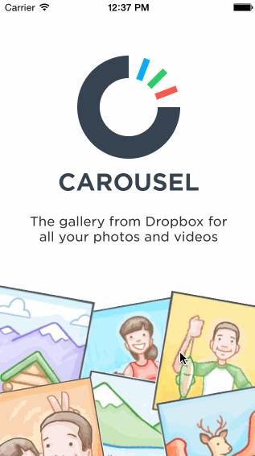

# CodePath Project 1
Carousel flow

Time spent: ~8 hours spent in total

Completed milestones:

 * [x] 1. Setup

 * [x] 1. Static photo tiles on the initial screen
 * [x]    Optional: Photo tiles move with scrolling
 * [x] 2. Sign In
 * [x]    Tapping on email/password reveals the keyboard and shifts the scrollview and Sign In button up.
 * [x]    User sees an error alert when no email is present or no password is present.
 * [x]    User sees a loading screen upon tapping the Sign In button.
alertView.dismissWithClickedButtonIndex(0, animated: true) dismisses the loading screen with no buttons.
 * [x]    User sees an error alert when entering the wrong email/password combination.
 * [x]    User is taken to the tutorial screens upon entering the correct email/password combination.
 * [ ]    Optional: When the keyboard is visible, if the user pulls down on the scrollview, it will dismiss the keyboard.
 * [x]    Optional: On appear, scale the form up and fade it in.
 * [ ] 3. Optional: Sign Up
 * [ ]    Optional: Tapping in the form reveals the keyboard and shifts the scrollview and "Create a Dropbox" button up.
 * [ ]    Optional: Tapping the Agree to Terms checkbox selects the checkbox.
 * [ ]    Optional: User is taken to the tutorial screens upon tapping the "Create a Dropbox" button.
 * [x] 4. Tutorial Screens
 * [x]    User can page between the screens
 * [x]    Optional: User can page between the screens with updated dots
 * [x]    Optional: Upon reaching the 4th page, hide the dots and show the "Take Carousel for a Spin" button.
 * [x] 5. Image Timeline
 * [x]    Display a scrollable view of images.
 * [x]    User can tap on the conversations button to see the conversations screen (push).
 * [x]    User can tap on the profile image to see the settings view (modal from below).
 * [x] 6. Settings
 * [x]    User can dismiss the settings screen.
 * [x]    User can log out
 * [ ] 7. Optional: Learn more about Carousel
 * [ ]    Optional: Show the "Learn more about Carousel" button in the photo timeline.
 * [ ]    Optional: Tap the X to dismiss the banner
 * [ ]    Optional: Track the 3 events:
 * [ ]    View a photo full screen
 * [ ]    Swipe left and right
 * [ ]    Share a photo
 * [ ]    Optional: Upon completion of the events, mark them green.
 * [ ]    Optional: When all events are completed, dismiss the banner.

Walkthrough of all user stories:

GIF created with [LiceCap](http://www.cockos.com/licecap/).
